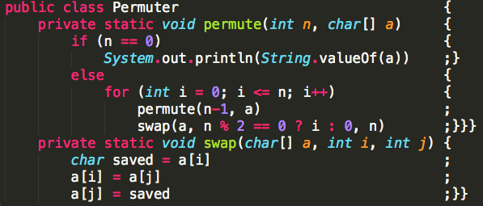

# FightingSpirit

투혼1.3.scx

put brace, semicolon away from your code!


## what is it?

Fighting Spirit helps using C language like python style



if you're python lover you might want to write codes like that way

```c
#include <stdio.h>

int main() {
    for (int i = 0; i < 10; i++) {
        for (int j = 0; j < 10; j++) {
            printf("%d times %d is %d \n", i, j, i * j);
        }
    }
    return 0;
}

```

      ↓ ↓ ↓ ↓ ↓ ↓

```c
#include <stdio.h>

int main()                                                                         {
    for (int i = 0; i < 10; i++)                                                   {
        for (int j = 0; j < 10; j++)                                               {
            printf("%d times %d is %d \n", i, j, i * j)                            ;}}
    return 0                                                                       ;}

```

## How to use fighting spirit

### Install

```
npm install fighting-spirit -g
```

you might need to install node first (if you don't have it yet)

### Run

```sh
fight
```

basically it's all you need to do but there's more options

## options

### --outDir

Not yet implemented

~~Redirect output structure to the directory.~~

### --no-overwrite

with this option, literally it will not overwrite your source

but it will make new file(extension named .cf, .hf) and write.

### --no-shorten

with this option, seperate closing brace and semicolon

for example,

without this option 

```c
                           ;
                           }
                           }
``` 

but without this option(default)

```c
                           ;}}
```

### --help

you can get help messages

### --version

shows version
